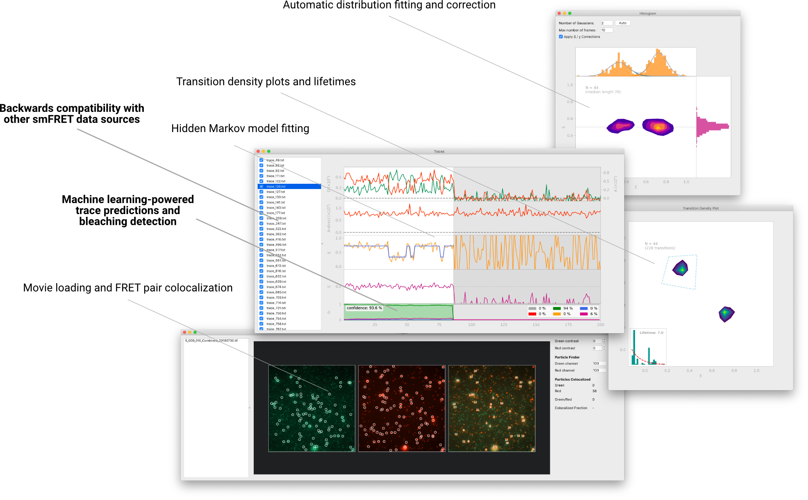
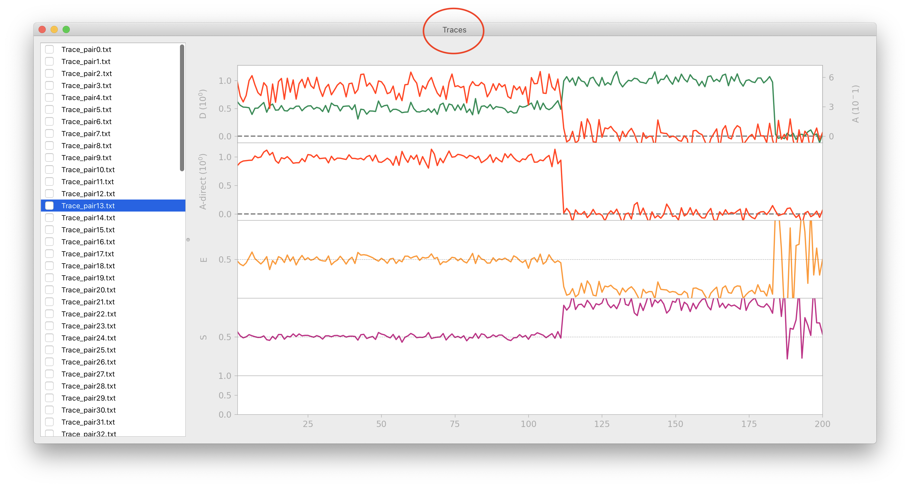

## DeepFRET
A fully open-source, all-inclusive software platform for doing total internal reflection microscopy (TIRFm) single
molecule FRET (smFRET) fast and efficiently. The key feature is reverse-loading of ASCII traces, and
*Keras/TensorFlow-powered automatic trace sorting*. Features include

- Advanced trace sorting
- Optical correction factors
- Hidden Markov model fitting and lifetime plotting
- Memory-free movie batch loading
- Distribution plotting and fitting
- Simulation of smFRET data
- Backwards-compatibility with iSMS-exported data

If you'd like to play around with just the Keras/TensorFlow model, please go to
https://github.com/komodovaran/DeepFRET-Model

## How to cite
*Publication coming soon!*

## 1. Installing and running the software
### 1.1 Launching the DeepFRET GUI from executable
Download the pre-compiled version
[here](https://drive.google.com/open?id=1jwTls9Yf2hwd1JHfd31-d6NvUVzrOXtJ).

(Note: currently only available for MacOS)

### 1.2 Launching DeepFRET GUI from Python source code.
1. Install Python 3.7.0. Other versions *might* work, but this is not
guaranteed.

2. Download repository contents.

3. Create a [virtual environment](https://packaging.python.org/guides/installing-using-pip-and-virtual-environments/)
environment with `python3 -m venv venv` in the current directory.

4. Activate environment with `source venv/bin/activate` if on MacOS/Linux or
`call venv\scripts\activate.bat` if on Windows.

5. While still in the environment, install all packages with
`pip install -r requirements.txt`

6. Launch the GUI with `python3 src/main/python/main.py`

### 1.3 Modifying and compiling the DeepFRET GUI to a standalone executable:
1. Follow all steps for launching DeepFRET, above.
2. Unzip the `hooks.zip` and overwrite the files in `venv/lib/python3.7/site-packages/PyInstaller/hooks/`.
3. Run `compile.py` and wait until the script finishes.

If the above steps worked, you can now edit any part of the code, and re-compile it
(or just run it from the main.py script, if desired).

Most interface elements are arranged in the `.ui` files, and can be edited through
[Qt Creator](https://www.qt.io/offline-installers) and then converted to Python files with `generate_ui.py`.

## 2. Loading data
1. To load videos, open the application's main window ('Images')

and go to File &rightarrow; Open files. The current
version of DeepFRET supports *only* videos made with alternating laser excitation (ALEX). Donor order and appearance
can be set in Preferences. The rest of the video layout is auto-guessed by the software and doesn't allow for
fine-tuning, so be sure to set up new experiments properly!
 
 
 2. If you've already exported a lot of smFRET traces from another software, but want to do your analysis in DeepFRET,
 you can even load in traces directly, without movies. Simply make sure that the trace window ('Traces') is the active
 window, and follow the same steps as above for loading data. This works both for traces with and without ALEX.
 